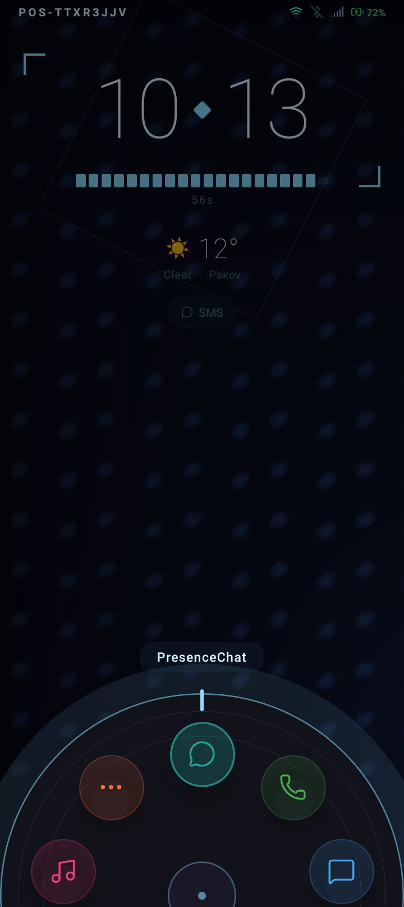
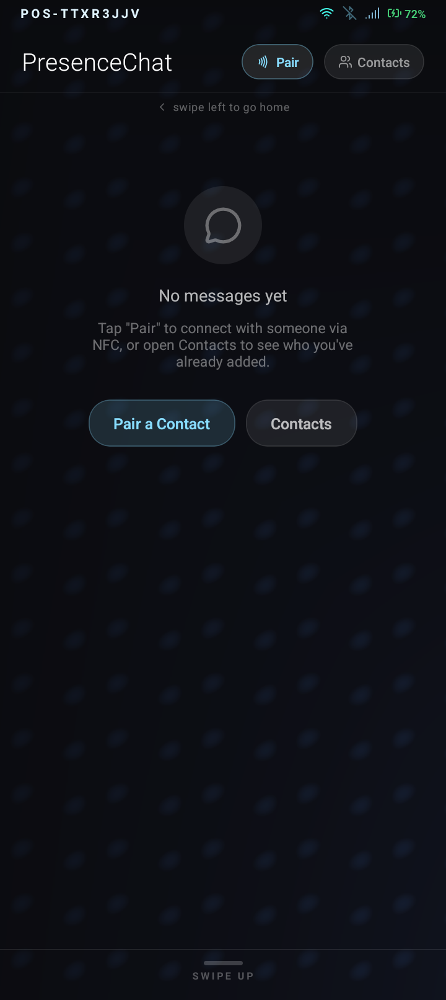
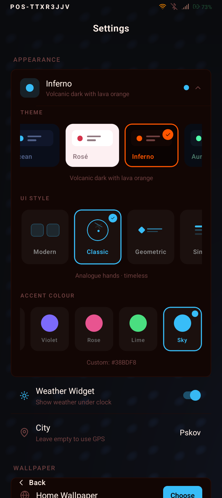
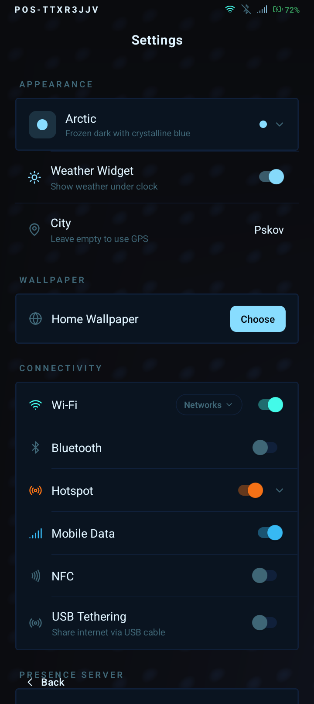
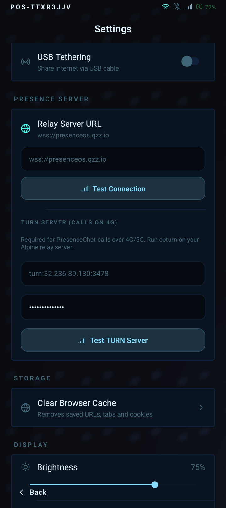
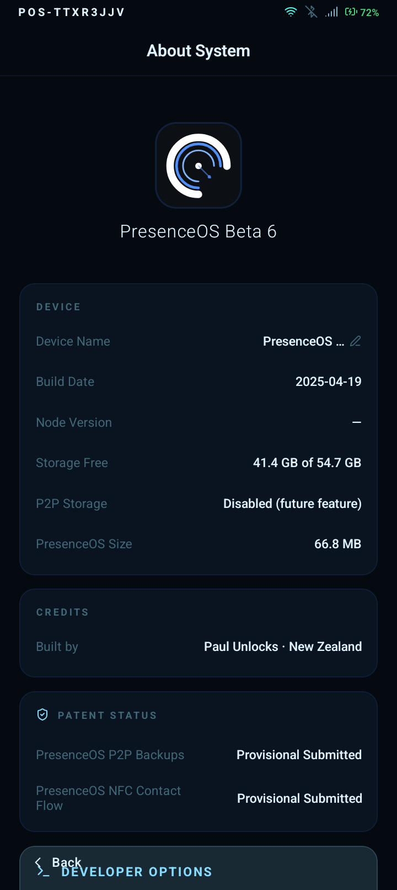

# PresenceOS Beta 6

A distraction-free Android experience.

## Screenshots

  
  
  
  
  
  

## What Works

- Wi-Fi
- Hotspot
- Bluetooth
- 4G/5G Mobile Data
- PresenceChat voice and video calls (device-to-device, requires relay server online)

## Requirements

- Android device running a GSI or AOSP build targeting **SDK 36**
- [Magisk](https://github.com/topjohnwu/Magisk) installed

## Installation

1. Download the latest release zip from the [Releases](../../releases) page.
2. Open Magisk → **Modules** → **Install from storage**.
3. Select the downloaded zip and flash it.
4. Reboot.
5. When prompted, grant all root and normal permissions PresenceOS requests.
